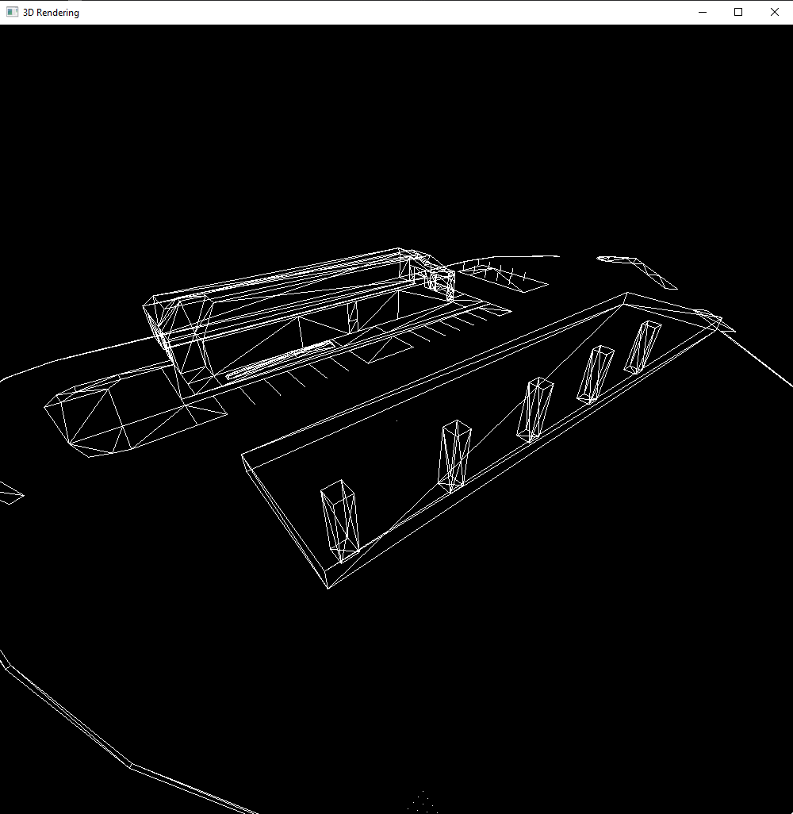

# 3DModelingCPP
3D Modeling program built in C++ OpenGL.

WASD/Space/Shift to move, arrow keys for the camera. Everything is custom from the rendering methods to the file format--excepting the 2d drawing which is handled by OpenGL.

Integrated console with commands to enable different interaction modes and features and save and load files.

